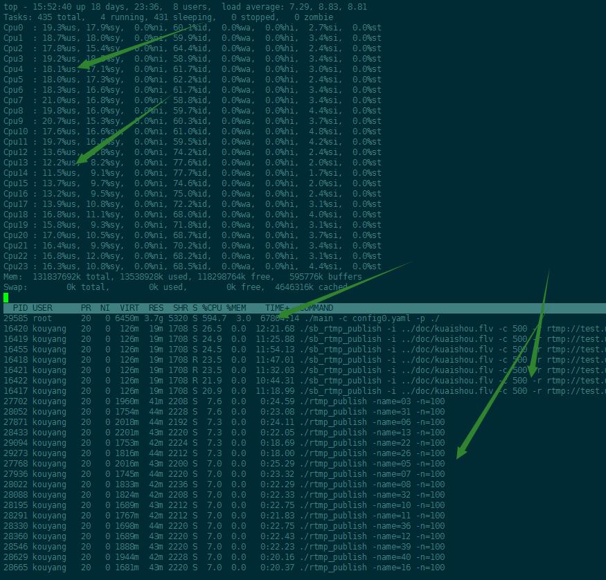
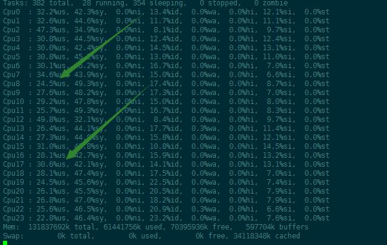

# rtmpServerStudy
just for study golang and AV knowledge

纯golang直播服务器：
修改自joy4

- 安装和使用非常简单；

- golang version >1.9

#### 支持的传输协议
- [x] RTMP
- [x] AMF
#### 支持的容器格式
- [x] FLV
- [x] TS

### 支持推流传输协议
- [x] tcp
- [x] quic
- [x] kcp

#### 支持的编码格式
- [x] H264
- [x] H265 ()
- [x] AAC

#### 从源码编译
1. 下载源码 `git clone https://github.com/KouChongYang/rtmpServerStudy`
2. cd rtmpServerStudy 目录
2. cd main 目录下执行 `go build`

## 使用
1. linux 运行
2. 启动服务：执行 `./main -c config.yaml -p ./ ` 二进制文件启动 rtmp server 服务；
3. 上行推流：通过 `RTMP` 协议把视频流推送到 `rtmp://test.uplive.com:1935/live/test`，
例如使用 `ffmpeg -re -i 4b.flv -c copy -f flv rtmp://127.0.0.1:1935/123?vhost=test.uplive.com/live` 推送；
或者绑定host test.uplive.com 127.0.0.1 直接通过以下命令推送`ffmpeg -re -i 4b.flv -c copy -f flv rtmp://test.uplive.com/live/123`
亦或直接通过obs推流
4. 下行播放：支持以下三种播放协议，播放地址如下：
    - `RTMP`:`rtmp://test.live.com:1935/live/123`
    - `FLV`:`http://test.live.com:8087/live/123.flv`
## 配置文件说明


```
RtmpServer:
  ClusterCnf: ["127.0.0.1:1935","10.137.16.47:1935"] # 集群机器列表
  SelfIp: "127.0.0.1:1935" # 本机机器
  RtmpListen: [":1935","/tmp/rtmp.socket8"] # rtmp 监听列表
  HttpListen: [":8087","/tmp/http.socket6"] # http 监听列表
  QuicListen: ":443" #quic server监听端口
  KcpListen: ":9997" #kcp server监听端口

UserConf:
  PublishDomain:
    test.uplive.com: # 推流域名
      UniqueName: test #用户标识
      App:     #app
        live:
          GopCacheNum: 2 #gop 缓存个数（默认2个gop可以，达到快速首屏的效果）
          ExtTimeSend: 1
          RecodeFlv: 1 #flv 录制
          RecodeHls: 1 # hls 录制
          hlsFragment: "5s" #hls 录制间隔
          RecodeFlvPath: "/dev/shm/data/flv"
          RecodeHlsPath: "/data/hls"
          RecodePicture: 1
          TurnHost: ["test.uplive.com/test"] #转推地址
    PlayDomain:           #拉流域名
      test.live.com:
        UniqueName: test
        App:
            live:
```

### 性能比较
1. nginx rtmp 性能比较
#### 压测方法

* 使用sb_rtmp_publish 压测7500路，500kb码率的流压测，压测报告如下：

- gortmp 性能：



- nginx rtmp 性能：



### 首屏比较
